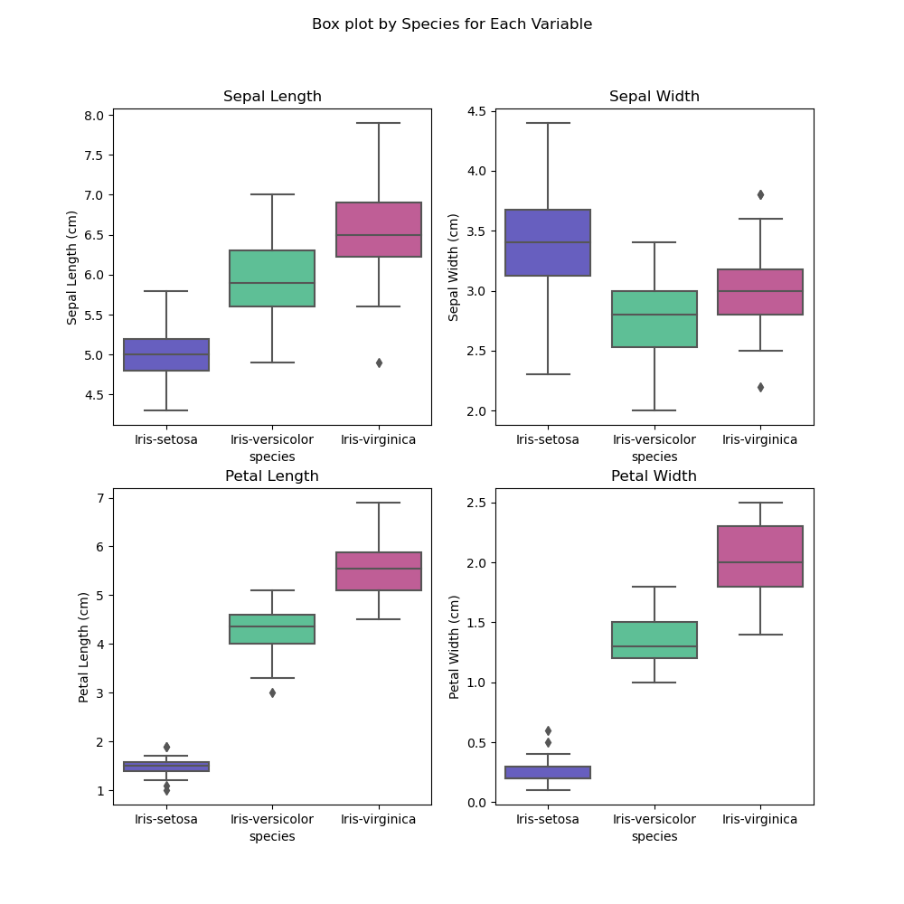

Author: Irene Kilgannon

Student ID: G00220627

This is my analysis of Fisher's Iris data set for the programming and scripting module for a [Higher Diploma in Science in Computing in Data Analytics](https://www.gmit.ie/higher-diploma-in-science-in-computing-in-data-analytics) at Atlantic Technological University.

## Project Statement
* Research the data set and summarise it in a [README](https://github.com/IreneKilgannon/pands-project/blob/main/README.md).
* Download the data set and add it to my [GitHub repository](https://github.com/IreneKilgannon/pands-project).
* Write a program called [analysis.py](https://github.com/IreneKilgannon/pands-project/blob/main/analysis.py): 
    1. outputs a summary of each variable to a single text file, [analysis.txt](https://github.com/IreneKilgannon/pands-project/blob/main/analysis.txt)
    2. saves a histogram of each variable to png files.
    3. outputs a scatter plot of each pair of variables.
    4. any other analysis.

## How To Run The Project

__Step 1__ Download and install [Anaconda](https://www.anaconda.com/download). Anaconda is a Python distributon package and comes with pre-installed packages such as [pandas](https://pandas.pydata.org/docs/user_guide/index.html#user-guide), [NumPy](https://numpy.org/doc/stable/user/whatisnumpy.html), [Matplotlib](https://matplotlib.org/) and [Seaborn](https://seaborn.pydata.org/) which are required for this project. Please note that when installing Anaconda it is important to check the two boxes for:
  * Add Anaconda3 to my PATH environment variable
  * Register Anaconda3 as my default 
  


__Step 2__ Download and install [Visual Studio Code](https://code.visualstudio.com/).

__Step 3__ Download [Cmder.app](https://cmder.app/).

__Step 3__ Each file was written in VScode and pushed to the [pands-project repository](https://github.com/IreneKilgannon/pands-project) on GitHub for assessment.

__Step 5__ Open Cmder (or the terminal in VSCode) and enter the following to clone the repository from GitHub:

    git clone https://github.com/IreneKilgannon/pands-project.git

__Step 5__ To run analysis.py, in the correct directory of either Cmder or the terminal in VSCode enter: python analysis.py


## Get Help

If you have any questions or queries you can contact me at g00220627@atu.ie or alternatively [submit an issue](https://github.com/IreneKilgannon/pands-project/issues).

***

## Background to Fisher's Iris Data Set

In 1928 Edgar Anderson published his paper entitled ['The Problem of Species in the Northern Blue Flags, _Iris versicolor_ and _Iris virginica_'](https://www.biodiversitylibrary.org/page/15997721). Anderson was a evolutionary biologist interested in answering two questions namely, what are species and how have they originated? Between 1923 and 1928 he and his team studied _Iris versicolor_ at a number of different sites from Ontario in Canada to Alabama in the United States, by measuring a number of different iris characteristics. Surprisingly his study found that there were actually two iris species present, _Iris versicolor_ and _Iris virginia_ and that it was possible to differentiate between them by geographic location. This is reflected in the [common names of these two species of iris](https://hgic.clemson.edu/factsheet/rain-garden-plants-iris-versicolor-and-iris-virginica/). _Iris versicolor_ is commonly known as the Northern blue flag iris and _Iris virginica_ is commonly known as the Southern blue flag iris.


The data set is commonly known as Fisher's Iris Data set after the statistician and biologist, [Ronald Fisher](https://en.wikipedia.org/wiki/Ronald_Fisher). The data measurements for _Iris setosa_ and _Iris versicolor_ in Fisher's data set were collected by Anderson from the same colony of plants in the Gaspé Peninsula, Quebec in 1935. According to [Unwin and Kleinman](https://academic.oup.com/jrssig/article/18/6/26/7038520) the _Iris virginica_ data samples were from Anderson's original research and were collected in Camden, Tennessee. Fisher collated and analysed the data and in 1936 published his results in the Annals of Eugenics with the title of [The Use of Multiple Measurements in Taxonomic Problems](https://onlinelibrary.wiley.com/doi/epdf/10.1111/j.1469-1809.1936.tb02137.x). He used a statistical method, linear discriminant analysis to attempt to distinguish the different iris species from each other. He found that _Iris setosa_ was easily distinguishable from the other two iris species using this method. 


Fisher's data set can viewed in his published paper but, in our computer age, the data set is available to download at [UCI Maching Learning Repository](https://archive.ics.uci.edu/dataset/53/iris). The data set is still very widely used with currently over 700,000 views of the data set on the UCI website. It is worth mentioning that there is a move away from using this data set due to Fisher's work in eugenics.

## Import the Required Modules.

The following modules are required for this analysis:
* [pandas](https://www.w3schools.com/python/pandas/pandas_intro.asp) - for manipulating data and for performing data analysis.
* [numpy](https://www.w3schools.com/python/numpy/default.asp) - performs a wide variety of mathematical calculations on arrays.
* [matplotlib.pyplot](https://www.geeksforgeeks.org/python-introduction-matplotlib/) - used to create plots e.g. bar plots, scatter plots, histograms.
* [seaborn](https://realpython.com/python-seaborn/) - a python data visualisation library based on matplotlib. Usually requires less code syntax than matplotlib.
* [plotting](https://github.com/IreneKilgannon/pands-project/blob/main/plotting.py) - a module I developed that will create and save seaborn histograms and seaborn scatter plots for all the numeric data in a data set. 
* [sklearn](https://scikit-learn.org/stable/) is required for machine learning. 

```python
import numpy as np
import pandas as pd
import matplotlib.pyplot as plt
import seaborn as sns
import plotting as pt

# For linear regression analysis the following modules are required:
from sklearn.linear_model import LinearRegression
from sklearn.model_selection import train_test_split
from sklearn.metrics import mean_squared_error
from sklearn.model_selection import cross_val_score, KFold
```

## Load the Data Set

The data set was downloaded from [UCI Maching Learning Repository](https://archive.ics.uci.edu/dataset/53/iris) and imported. This csv file does not contain column names and the column names were obtained from the variables table on the [information page of the iris data set](https://archive.ics.uci.edu/dataset/53/iris). The column names are sepal_length_cm, sepal_width_cm, petal_length_cm, petal_width_cm and species.

A number of methods were explored to add the column names. This reference, [adding headers to a dataframe in pandas a comprehensive-guide](https://saturncloud.io/blog/adding-headers-to-a-dataframe-in-pandas-a-comprehensive-guide/) was particularily helpful. The quickest method is to add the column names using the names parameter when the data set is loaded. I did not add "_cm" to the columm names.

```python
iris = pd.read_csv("iris_data.csv", names = ['sepal_length', 'sepal_width', 'petal_length', 'petal_width', 'species'])
```

## Summary of the Data Set

_Task:_ Output a summary of each variable to a single text file, [analysis.txt](https://github.com/IreneKilgannon/pands-project/blob/main/analysis.txt).

[With open('file_name.txt', 'mode')](https://ioflood.com/blog/python-open-file) is used to open a text file and the mode will then tell python what to do with the file. Two modes were used in this analysis. First write text, `'wt'` was used to both to create the analysis.txt file and to write to it. After that the append mode, `'a'` was used to append the results of the exploratory data analysis to analysis.txt. One major advantage of using `with open()` is that the file will automatically close when the programme has finished running.

```python
    with open('analysis.txt', 'wt') as f:
        f.write(head)
```

`f.write()` will only write strings to a txt file. [This reddit post](https://www.reddit.com/r/learnpython/comments/12emhsa/how_do_i_save_the_output_of_the_python_code_as_a/) suggested saving the output to a variable and then result could be written to the analysis.txt file, which is what I did. 

<details>
<summary>Code written to analysis.txt to summarise the data set.</summary>

```python
#### Output a summary of each variable to a single txt file, analysis.txt ####
# Collating the necessary infomation for analysis.txt

#### Overall information about the data set

# Get the number of rows and columns in the data set.
shape = f'The shape of the data set is {iris.shape}. \n\n'

# Get the variable names.
column_names = f'Summary of the variable names in the data set are: \n {iris.columns} \n\n'

# Get the data types of the variables.
data_types = f'The data types in the data set are: \n{iris.dtypes}\n \n'

# Look for missing data, NaN
missing_values = f'Checking to see if there is any missing data or NaN. \n{iris.isna().sum()} \n \n'

#### Summary information for the species column

# Uniques names in the species column.
unique = f"The unique names in the species column are: \n {iris['species'].unique()} \n\n"

# Value count of each species.
count_species = f"A count of each species: \n {iris['species'].value_counts()} \n\n"

#### Summary information for the numeric columns

# Summary statistics for the overall the data set
summary_statistics = f'Overall summary statistics for the data set. \n{iris.describe()} \n\n'

# Summary statistics grouped by species. Transpose the result to for an easier read. 
summary_by_species = f"Summary statistics grouped by species \n{iris.groupby('species').describe().transpose()} \n\n"

# Create dataframes for each iris species.
setosa = iris[iris['species'] == 'Iris-setosa']
versicolor = iris[iris['species'] == 'Iris-versicolor']
virginica = iris[iris['species'] == 'Iris-virginica']

# Summary Statistics for Iris setosa
setosa_summary = f'Summary statistics for Iris setosa are: \n{setosa.describe()} \n\n'

# Summary Statistics for Iris versicolor
versicolor_summary = f'Summary statistics for Iris versicolor are: \n{versicolor.describe()} \n\n'

# Summary Statistics for Iris virginica
virginica_summary = f'Summary statistics for Iris virginica are: \n{virginica.describe()} \n\n'

# Append the to the analysis.txt file created previously
with open('analysis.txt', 'a') as f:
    f.write(shape)
    f.write(column_names)
    f.write(data_types)
    f.write(missing_values)
    f.write(unique)
    f.write(count_species)
    f.write(summary_statistics)
    f.write(summary_by_species)
    f.write(setosa_summary)
    f.write(versicolor_summary)
    f.write(virginica_summary)
```
</details>

__Summary of the data set__

The iris data set is a small data set with 150 rows and five columns with each row corresponding to a different flower sample. There is no data missing in the data set.

The five variables in the data set are:
* sepal_length
* sepal_width 
* petal_length
* petal_width 
* species 

There are three iris species, _Iris setosa_, _Iris versicolor_ and _Iris virginica_ in the species column with 50 samples for each species. The data type of the species column is object as it is text. 

The sepal length, sepal width, petal length and petal width columns are all continuous numeric data. They were all measured in cm to one decimal place and they have been correctly assigned the datatype of float (floating point number). 

A brief description of an iris flower will help give meaning to the variable names. Each iris has three true petals and three sepals. The three petals are upright and are sometimes known as standards. Sepals are a modified leaf, known as falls and its function is to protect the developing flower bud. When the flower has bloomed the iris's sepal is described as "the landing pad for bumblebees" by the [US Forest Service](https://www.fs.usda.gov/wildflowers/beauty/iris/flower.shtml). This diagram nicely illustrates the difference between the petals and the sepals and how the width and length of each were measured.


Summary statistics for numeric data are easily obtained using the [describe method](https://www.w3schools.com/python/pandas/ref_df_describe.asp). It gives a count of each variable and some statistics such as the min, max, mean and std deviation for each variable.

```python
# Summary statistics for the overall data set
summary_statistics = f'Overall summary statistics for the data set. \n{iris.describe()} \n\n'
```

Overall summary statistics for the data set.
|      | sepal_length | sepal_width | petal_length | petal_width|
|---|---|---|---|---|
|count |   150.000000 |  150.000000  |  150.000000  | 150.000000|
|mean  |     5.843333 |    3.054000  |    3.758667  |   1.198667|
|std   |     0.828066 |    0.433594  |    1.764420  |   0.763161|
|min   |     4.300000 |    2.000000  |    1.000000  |   0.100000|
|25%   |     5.100000 |    2.800000  |    1.600000  |   0.300000|
|50%   |     5.800000 |    3.000000  |    4.350000  |   1.300000|
|75%   |     6.400000 |    3.300000  |    5.100000  |   1.800000|
|max   |     7.900000 |    4.400000  |    6.900000  |   2.500000| 

The summary statistics reveal that petal lengths and petal widths are smaller than the sepal lengths and sepal widths. Petal width is the smallest variable with the min length of 0.1 cm, a mean of 1.20 cm with max size of 2.5 mm. Sepal length is the largest of the four variables with a mean of 5.8 mm. I would imagine that the size difference between the sepals and petals would help an amateur botanist distinguish between them if they could not do so by looking at the flower.

Summary Statistics for Each Iris Species

```python
# Summary statistics grouped by species. Transpose the result to make easier comparisons between the species.
summary_by_species = f"Summary statistics grouped by species \n{iris.groupby('species').describe().transpose()} \n\n"
```

The [groupby method](https://pandas.pydata.org/pandas-docs/stable/reference/api/pandas.DataFrame.groupby.html) is used to group by the results of a method, such as describe() by a specific column or list of columns. When groupby was used on the species column, the result was a difficult to read table of 3 rows and 32 columns. This [blog](https://www.angela1c.com/projects/iris_project/investigating-the-iris-dataset/) suggested transposing the results of the groupby species to give more readable results. The [transpose method](https://pandas.pydata.org/pandas-docs/stable/reference/api/pandas.DataFrame.transpose.html) converts rows into columns and vice-versa. Now it is much easier to make direct comparisons between the species for each variable. 

Summary statistics grouped by species
|species      |      | Iris-setosa | Iris-versicolor  |Iris-virginica|
|---|--- |---|---|---|
|sepal_length| count |   50.000000 |       50.000000  |     50.000000|
|            | mean  |    5.006000 |        5.936000  |      6.588000|
|            | std   |    0.352490 |        0.516171  |      0.635880|
|            | min   |    4.300000 |        4.900000  |      4.900000|
|            | 25%   |    4.800000 |        5.600000  |      6.225000|
|            | 50%   |    5.000000 |        5.900000  |      6.500000|
|            | 75%   |    5.200000 |        6.300000  |      6.900000|
|            | max   |    5.800000 |        7.000000  |      7.900000|
|sepal_width | count |   50.000000 |       50.000000  |     50.000000|
|            | mean  |    3.418000 |        2.770000  |      2.974000|
|            | std   |    0.381024 |        0.313798  |      0.322497|
|            | min   |    2.300000 |        2.000000  |      2.200000|
|            | 25%   |    3.125000 |        2.525000  |      2.800000|
|            | 50%   |    3.400000 |        2.800000  |      3.000000|
|            | 75%   |    3.675000 |        3.000000  |      3.175000|
|            | max   |    4.400000 |        3.400000  |      3.800000|
|petal_length| count |   50.000000 |       50.000000  |     50.000000|
|            | mean  |    1.464000 |        4.260000  |      5.552000|
|            | std   |    0.173511 |        0.469911  |      0.551895|
|            | min   |    1.000000 |        3.000000  |      4.500000|
|            | 25%   |    1.400000 |        4.000000  |      5.100000|
|            | 50%   |    1.500000 |        4.350000  |      5.550000|
|            | 75%   |    1.575000 |        4.600000  |      5.875000|
|            | max   |    1.900000 |        5.100000  |      6.900000|
|petal_width | count |   50.000000 |       50.000000  |     50.000000|
|            | mean  |    0.244000 |        1.326000  |      2.026000|
|            | std   |    0.107210 |        0.197753  |      0.274650|
|            | min   |    0.100000 |        1.000000  |      1.400000|
|            | 25%   |    0.200000 |        1.200000  |      1.800000|
|            | 50%   |    0.200000 |        1.300000  |      2.000000|
|            | 75%   |    0.300000 |        1.500000  |      2.300000|
|            | max   |    0.600000 |        1.800000  |      2.500000|

Analysing these results we can see that _Iris setosa_ is the smallest flower in the data set. _Iris virginica_ is the largest flower species. _Iris setosa_ has the smallest measurements for three out of the four variables. Surprisingly the sepal width of _Iris setosa_ is larger than the sepal width for both _Iris versicolor_ and _Iris virginica_. The petal width and petal length measurements of _Iris setosa_ are substantially smaller than the corresponding measurements for _Iris versicolor_ and _Iris virginica_.

A [seaborn boxplot](https://seaborn.pydata.org/generated/seaborn.boxplot.html) is a nice method to visually compare summary statistics about a data set. It gives us most of the same information that the describe method does but as it is visual it is easier and quicker to make comparisons. One difference between the describe method and a box plot is that describe gives the mean, whereas a box plot displays the median value of the variable.


_Different parts of a boxplot | Image: Michael Galarnyk_


<details>
<summary>Box plot code</summary>

```python
# Create a box plot to visually compare the summary statistics across the three species in the data set.

# Create a fig, ax plot
fig, ax = plt.subplots(2,2, figsize = (10, 10))

# Create a box plot for each variable, coloured by species.
sns.boxplot(ax = ax[0, 0], x = 'species', y = 'sepal_length', data = iris)
sns.boxplot(ax = ax[0, 1], x = 'species', y= 'sepal_width', data = iris)
sns.boxplot(ax = ax[1, 0], x = 'species', y = 'petal_length', data = iris)
sns.boxplot(ax = ax[1, 1], x = 'species', y = 'petal_width', data = iris)

# Overall plot title
plt.suptitle('Box plot by Species for Each Variable')

# Label each plot
ax[0,0].set_title('Sepal Length')
ax[0,1].set_title('Sepal Width')
ax[1,0].set_title('Petal Length')
ax[1,1].set_title('Petal Width')

# Label y-axis
ax[0,0].set_ylabel('Sepal Length (cm)')
ax[0,1].set_ylabel('Sepal Width (cm)')
ax[1,0].set_ylabel('Petal Length (cm)')
ax[1,1].set_ylabel('Petal Width (cm)')

# Save the box plot
plt.savefig('plots\\Box_plot.png')
plt.close()
```
</details>




The box plot confirms the analysis from the summary statistcs. It clearly demonstrates that the petal lengths and petal widths of _Iris setosa_ are distinctly different to the other two iris species. Their petal lengths and widths are much smaller than _Iris versicolor_ and _Iris virginica_. This will aid in classifying _Iris setosa_. _Iris virginica_ is the largest species in the data set and has larger sepal lengths, petal lengths and petal widths than the other flower species. 


## Histograms of Each Variable.

_Task_: Save a histogram of each variable to png files.

[Histograms](https://thirdspacelearning.com/gcse-maths/statistics/histogram/) are used to plot continuous numeric data and shows the distribution of values. The data is divided up into a range of values, called bins. The number of bins chosen can affect the appearance of the histogram. The default number of bins for a matplotlib histogram is ten. For seaborn histograms the default for the bins parameter is 'auto' so it will optimise the histogram with what it calculates to be the correct number of bins.

The four variables of sepal length, sepal width, petal length and petal width are continuous numeric data and can be plotted as histograms.

<details>
<summary>Histogram code</summary>

```python
fig, ax = plt.subplots(2, 2, figsize = (13, 13))

# Histogram of sepal length
sns.histplot(iris, x = 'sepal_length', ax = ax[0,0])
ax[0, 0].set_title('Histogram of Sepal Length')
ax[0, 0].set_xlabel('Sepal Length (cm)')

# Histogram of sepal width
sns.histplot(iris, x = 'sepal_width', ax = ax[0, 1])
ax[0, 1].set_title('Histogram of Sepal Width')
ax[0, 1].set_xlabel('Sepal Width (cm)')

# Histogram of petal length
sns.histplot(iris, x = 'petal_length', ax = ax[1, 0])
ax[1, 0].set_title('Histogram of Petal Length')
ax[1, 0].set_xlabel('Petal Length (cm)')

# Histogram of petal width
sns.histplot(iris, x = 'petal_width', ax = ax[1, 1])
ax[1, 1].set_title('Histogram of Petal Width')
ax[1, 1].set_xlabel('Petal Width (cm)')

# Overall title for the histogram
plt.suptitle('Histogram of the Iris Data Set')

# Save the histogram
plt.savefig('plots\\Summary_Histogram.png')
plt.close()
```
</details>


The four histograms all have an surprisingly different shapes and are comparable to the plots obtained in this journal [article](https://www.researchgate.net/figure/The-histograms-on-each-feature-of-the-Iris-data-set_fig4_309515576). The histograms should have a [normal distribution](https://www.youtube.com/watch?v=rzFX5NWojp0) and only one plot, the histogram of sepal width looks like it approaches a normal distribution. 


_Normal Distribution_

It is worth investigating to see if the species of the flower is affecting the shape of the curve. Rather than create a plot for each of the variables by coding each of the variables separately (as I did above), I wrote function to plot each of the variables in the data set by looping through any column whose datatype is either integer or float. The histograms were created using a [seaborn histplot](). Seaborn's hue parameter makes it very easy to differentiate the data by a categorical variable, which in this case is species. Hue is an optional argument for the function. The plotted function will create the histograms created above but as individual histograms and not as the [figure, axes plot](https://stackoverflow.com/questions/5575451/difference-between-axes-and-axis-in-matplotlib) created above. 

```python
# To plot the histograms created previously using the plotting module.
plot_hist(iris)
```

<details>
<summary>Code to Create Histograms Using the plotting.py Module.</summary>

```python
# This function is contained in the plotting.py module

# Function to plot histograms for all the numeric variable in a dataframe
def plot_hist(df, hue = None):
    '''Plot a seaborn histogram of all the numeric variables in a dataframe. Optional hue parameter for a categorical variable. 

    Parameters
    ----------
    df : dataframe
    hue : a categorical variable in the data set. Optional argument.
    
    Returns
    -------
    Histograms in the plots directory for each of the numeric variables in the data set as a png files.
    '''
    for x in df:
        # Histograms are for continuous numeric data, continue to the next column if the datatype of the column is not an integer or float.
        if df[x].dtype == 'int' or df[x].dtype == 'float':
            # Create a seaborn histogram, hue parameter is very useful to differentiate by a categorical variable.
            sns.histplot(x = x, data = df, hue = hue)
            # Add title, capitalizing the heading and replacing '_' with a blank space.
            plt.title(f"Histogram of {x.title().replace('_', ' ')}")
            # Label x-axis,  y-axis will be automatically labelled as 'Count' by seaborn
            plt.xlabel(f"{x.replace('_', ' ')}")
            # Save the histogam in the plots directory
            plt.savefig(f'plots\\Histogram_of_{x}.png')
            # Close the plot when it has been saved
            plt.close()

# In analysis.py, plotting has been imported as pt 
# Call the plot_hist function from the plotting module on the iris data set.
pt.plot_hist(iris, hue = 'species')
```
</details>

To make a side by side comparison of the histograms I have displayed them in the table below. I would like to make figure, axes plot of the histograms so that there are all plotted in the same figure but to date I have been unable to do this.

|Histograms created using plotting.py||
|---|---|
|||
|||


Now that the data has been classified by species we can see that most of the histograms better resemble a normal distribution. The unusual shape of the previous histograms is due to the overlapping data points for the different iris species. As the data set only has 50 data points for each species, it would require more data points to fully resemble a normal distribution. The histogram for petal length and petal width for _Iris setosa_ is different to the other histograms as it appears to be right skewed. As there are only two bins for the petal length and petal width of _Iris setosa_ it's worth creating histograms for these to investigate if the number of bins is affecting the results. 

<details>
<summary>Code to Create Histograms for Petal Length and Petal Width for Iris setosa</summary>

```python
# Histograms for petal length and petal width for Iris setosa
fig, ax = plt.subplots(1, 2)
sns.histplot(setosa, x = 'petal_length', ax = ax[0])
sns.histplot(setosa, x = 'petal_width', ax = ax[1])
plt.suptitle('Histograms of Petal Length and Width for Iris setosa')
plt.savefig('plots\\Hist_Setosa_pl.png')
plt.close()
```
</details>


We can clearly see that the number of bins did affect the distribution. Both petal length and petal width for _Iris setosa_ do have a normal distribution. 

The histograms created in this analysis are comparable to [other analysis](https://medium.com/@nirajan.acharya666/exploratory-data-analysis-of-iris-dataset-9c0df76771df) of the data set. 

## Scatter Plots for Each Pair of Variables.

The purpose of a [scatter plot](https://www.atlassian.com/data/charts/what-is-a-scatter-plot) is to demonstrate the relationship between two continuous numeric variables. Scatter plots also indicate if there are any outlying points (outliers) away from the main data points that could disrupt accurate correlation.

Scatter plots can be created with [seaborn scatter plots](https://www.geeksforgeeks.org/scatterplot-using-seaborn-in-python/) and with [matplotlib's plt.scatter function](https://www.w3schools.com/python/python_ml_scatterplot.asp). Seaborn also has a [pairplot](https://seaborn.pydata.org/generated/seaborn.pairplot.html) feature to create a scatter plots between all of the variables in the data set. 

<details>
<summary>Code to create a pairplot</summary>
```python
# Use of pairplot
g = sns.pairplot(iris)
g.fig.suptitle('Pair Plot of the Numeric Variables in the Iris Data Set', y = 1.05)
plt.savefig('plots\\Pair_plot.png')
plt.close()
```
</details>


When we exam the pair plot we can see that there are two distinct clusters in most plots. Most have one large and one smaller cluster. From the information the histograms and box plots have provided the smaller cluster is probably _Iris setosa_. A scatter plot defined by hue for the species should confirm this. 

As part of my plotting module, there is also a function to create scatter plots for each of the numeric variables in the data set. The pair plot function creates twelve scatter plots for the four numeric variables in the iris data set. Each set of variables gets plotted twice e.g. petal width vs petal length and petal length vs petal width, so the same plot with the axis's reversed. The plot_scatter function in plotting.py is designed to generate half the number of plots created by pair plot, so each variable will only get plotted once against the other. Hue is an optional parameter for this function. The plot_scatter function will be used to create scatter plots for the data set, with hue equal to species.

<details>
<summary>Code to Create Scatter Plots Using Plotting.py.</summary>

```python
# This function is contained in the plotting.py module
def plot_scatter(df, hue = None):
    '''A function to plot a seaborn scatter plots of each pair of numeric variables in a dataframe.

    Parameters
    ----------
    df : dataframe
    hue : a categorical variable in the data set. Optional parameter/argument CHECK CORRECT TERM.
    
    Returns
    -------
    Saved scatter plots between all the numeric variables in the data set as a png file.
    '''
    # Initialize an empty list for plotted x variables
    plotted_x = []
    for x in df:
        # The variable, x is added to the plotted_x list
        plotted_x.append(x)
        # Only create a scatter plot of the numeric variables of data type integer or float.
        if df[x].dtype == 'int' or df[x].dtype == 'float':
            for y in df:
                # Only numeric data types will be plotted
                if df[y].dtype == 'int' or df[y].dtype == 'float':
                    # Continue if x and y are the same or if y is in the plotted_x list.
                    if x == y or y in plotted_x:
                        continue
                    else:
                        # Create a scatter plot
                        sns.scatterplot(data = df, x = x, y = y, hue = hue)

                        # Add title to plot, removing any underscores and capitalizing it. 
                        plt.title(f"Scatter plot of {y.title().replace('_', ' ')} vs {x.title().replace('_', ' ')}")

                        # Label x and y-axis
                        plt.xlabel(f"{x.title().replace('_', ' ')}")
                        plt.ylabel(f"{y.title().replace('_', ' ')}")

                        # Save a scatter plot for each pair of variables
                        plt.savefig(f"plots\\Scatterplot_{y.title().replace('_', ' ')}_vs_{x.title().replace('_', ' ')}.png")
                        plt.close()

# In analysis.py, plotting has been imported as pt 
# Call the plot_scatter function from the plotting module on the iris data set.
pt.plot_scatter(iris, hue = 'species')
```
</details>

|Scatter plots between all the variables in the Iris data set||
|---|---|
|||
|||
|||

These scatter plots demonstrate clearly that _Iris setosa_ is a distinct cluster. It does not overlap with with _Iris versicolor_ or _Iris virginica_ in any of the scatter plots. It is important to always cross check what appears to be an outlier in the scatter plot with the box plot. What I thought was an obvious outlier in the scatter plot for sepal width for_Iris setosa_ at 2.3 cm, is in the box plot the minimium value in the sepal width range for _Iris setosa_ and is not an outlier! As the data point is so far from the main set of data points I calculated the upper and lower limits for outliers as shown in this data camp course [handling outliers](https://campus.datacamp.com/courses/exploratory-data-analysis-in-python/data-cleaning-and-imputation?ex=12) to double check that this is correct. 


<details>
<summary>Code to Calculate the Lower and Upper Limits for Outliers.</summary>

```python
# Minimium value in sepal width column for Iris setosa.
min = setosa['sepal_width'].min()

# Identifying outliers.
# Calculating the range for outliers for the sepal width for Iris setosa.

# Calculate the 75th percentile using quantile function.
seventy_fifth = setosa['sepal_width'].quantile(0.75)

# Calculate the 25th percentile
twenty_fifth = setosa['sepal_width'].quantile(0.25)

# IQR (interquartile range) for sepal width. Difference between the 75th and 25th percentile.
s_width_iqr = seventy_fifth - twenty_fifth

# Upper Outliers, points outside the 75th percentile plus 1.5 times the IQR.
upper_limit = seventy_fifth + (1.5 * s_width_iqr)

# Lower Outliers, points outside the 25th percentile minus 1.5 times the IQR.
lower_limit = twenty_fifth - (1.5 * s_width_iqr)

with open('analysis.txt', 'a') as f:
    f.write(f'The minimium value in the sepal width column for Iris setosa is {min}\n')
    f.write(f'The lower limit for outliers in the sepal width column for Iris setosa is {lower_limit.round(2)}.\n')
    f.write(f'The upper limit for outliers in the sepal width column for Iris setosa is {upper_limit.round(2)}.\n\n')
```
</details>

    The minimium value in the sepal width column for Iris setosa is 2.3
    The lower limit for outliers in the sepal width column for Iris setosa is 2.3.
    The upper limit for outliers in the sepal width column for Iris setosa is 4.5.

As the lower limit for outliers for the sepal width of _Iris setosa_ is anything less than 2.3 cm, the data point at 2.3 cm is not considered an outlier. The values of the 75th and 25th percentile could also have been obtained from the results of the describe method. 

The clusters of _Iris versicolor_ and _Iris virginica_ overlap in all the scatter plots. In the plot of sepal length vs sepal width there is a significant amount of overlap. The least amount of overlap appears to be in the scatter plots between petal length and petal width and between petal width and sepal width. One widely used technique for classification in machine learning is called [K-nearest neighbours (KNN)](https://www.datacamp.com/tutorial/k-nearest-neighbor-classification-scikit-learn). The K-nearest neighbours algorithm looks at the nearest data points to the data point of interest and decides which cluster the data point most likely belongs to. Minimising the overlap of clusters will improve the chance of correct cluster assignment.

## Any Other Analysis

## Correlation Analysis

__What is Correlation?__

[Correlation](https://www.jmp.com/en_ca/statistics-knowledge-portal/what-is-correlation.html) tells us how two variables are related. It tells us what happens (if anything) to y if x increases. The value of the correlation coefficient ranges from -1 to 1. The sign indicates the direction of the relationship, with -1 indicating a strong negative correlation (as x increases, y decreases), 0 indicates no correlation and +1 is a strong positive correlation (as x increases, y increases).


_Image from realpython.com_


__Why is correlation important?__

When choosing the variables to use for predictive modelling and machine learning it is important to understand how the variables interact together to decide what features are important. The value of the correlation coefficient gives guidance on the best variables to choose as highly correlated variables will give more accurate models than poorly correlated variables. 

It is important to note that correlation does not mean causation. This means even though x and y are correlated, x does not necessarily cause y. There could be other variables, called [confounding variables](https://www.scribbr.com/methodology/confounding-variables/) involved which are related to the variables of interest which could lead to misleading results. 

Before the correlation coefficient is calculated it is important to create a scatter plot with a line of best fit (also known as a regression line or a trend line) to verify if there is a linear or a non-linear relationship between the data points. The most commonly used method to calculate the correlation coefficient, the [Pearson method correlation](https://www.youtube.com/watch?v=k7IctLRiZmo) is only suitable for linear plots. Please note that it is the spread of the data around the regression line that indicates if there is good correlation between the variables. The data points for variables with a high correlation coefficient will be closer to the trend line. 

Steps to fit a regression line to a scatter plot with numpy:
1. Convert the two columns to a [numpy array](https://sparkbyexamples.com/pandas/pandas-convert-column-to-numpy-array/).
2. Use numpy [numpy polyfit](https://numpy.org/doc/stable/reference/generated/numpy.polyfit.html) to fit a straight line between the x-axis data points and the y-axis data points.
3. Extract the values of m and c from np.polyfit.
4. The y-axis values for the regression line are generated from the equation of the line, $y = mx +  $, which for this example is `m * sepal_length_array + c`.

<details>
<summary>Using Numpy's Polyfit</summary>

```python
# Create a numpy array of the sepal length and sepal width columns
sepal_length_array = iris['sepal_length'].to_numpy()
sepal_width_array = iris['sepal_width'].to_numpy()

# Use numpy polyfit to fit a straight line between x and y.
# np.polyfit(x-axis, y-axis, deg). Deg = 1 for a linear equation.
m, c = np.polyfit(sepal_length_array, sepal_width_array, 1)

# Write the values for the slope, m and y-intercept, c to analysis.txt.
with open('analysis.txt', 'a') as f:
    f.write(f'The value of the slope is {m.round(3)}.\n')
    f.write(f'The value of the intercept is {c.round(3)}.\n\n')

```
</details>

The equation of a line is $y = mx + c$, where m is the slope and c is the y-intercept at x = 0. The values of m and c can be extracted from numpy's polyfit and these are used to calculated the y-values for the line.

    The value of the slope is -0.057.
    The value of the intercept is 3.389.


<details>
<summary>Plotting a Regression Line on a Scatter Plot with Numpy</summary>

```python
# Demonstrating how to plot a regression line on a scatter plot using numpy.
fig, ax = plt.subplots()

# A scatter plot of sepal Width vs sepal length using the numpy array generated in the previous cell.
ax.scatter(sepal_length_array, sepal_width_array)

# Plotting the trend line in green. The y-axis values are generated from the equation of the line, with m and c equal to the values generated above.
ax.plot(sepal_length_array, m * sepal_length_array + c, '#CF4E99')

# Axis labels.
plt.xlabel('Sepal Length (cm)')
plt.ylabel('Sepal Width (cm)')

# Title.
plt.title('Sepal Width vs Sepal Length')
plt.savefig('plots\\Numpy_reg_plot.png')
plt.close()
```
</details>


Fortunately there are faster ways to add a regression line. Two of the simplest are seaborn's [regplot](https://seaborn.pydata.org/generated/seaborn.regplot.html) (regression plot) and [lmplot](https://seaborn.pydata.org/generated/seaborn.lmplot.html) (linear model plot) functions. Regplot and lmplot generate very similiar plots but they have different parameters. Regplot is an axes-level function. Seaborn lmplot is a figure-level function with access to FacetGrid. FacetGrid means that multiple plots can be created in a grid with rows and columns. lmplot has the hue, col and row parameters to further differentiate the data points. It is also possible to use the pair plot function with the kind parameter equal to reg to create a regression plot of all the numeric variables.

It is not possible to to extract the values of m and c from a seaborn plot. Linear regression analysis is required.

<details>
<summary>Adding a Regression Line with Seaborn Lmplot</summary>

```python
# lmplot example. Sepal Width vs Sepal Length
sns.lmplot(iris, x = 'sepal_length_cm', y = 'sepal_width_cm', col = 'species')
plt.suptitle('Sepal Width vs Sepal Length by Species', y = 1.05)
plt.savefig('plots\\lmplot_example.png')
plt.close()

# Regression Line Pair Plot, kind = 'reg'
sns.pairplot(iris, kind = 'reg')
plt.suptitle('Regression Pair Plot of the Numeric Variables in the Iris Data Set', y = 1.05)
plt.savefig('plots\\Pair_Regression_plots.png')
plt.close()
```
</details>


## Calculate correlation coefficients

When the regression pairplot is analysed we can see that there is a linear relationship between all the variables in the data set so the correlation coefficient can be calculated using the [corr() function](https://pandas.pydata.org/docs/reference/api/pandas.DataFrame.corr.html) with the Pearson method. Correlation could also be carried out using [numpy's np.corrcoeff()](https://numpy.org/doc/stable/reference/generated/numpy.corrcoef.html).

``` python
# To calculate the correlation coefficient using corr() between sepal length and sepal width.
corr_SL_vs_SW = iris['sepal_length'].corr(iris['sepal_width'])

with open('analysis.txt', 'a') as f:
    f.write(f'The correlation coefficient between sepal length and sepal width is {corr_SL_vs_SW.round(3)}.\n\n')
```

    The correlation coefficient between sepal length and sepal width is -0.109.

A correlation coefficient of -0.109 is a weak negative correlation. As sepal width increases, sepal length decreases. The value of the slope of the line does not correlate with the value of the correlation coefficient. The sign of the slope does correspond with the sign of the correlation coefficient. A postive slope will mean that there is a positive correlation, a negative slope means a negative correlation. The correlation coefficient looks at the spread of data around the regression line. 

Once again there are a number of methods to calculate the correlation coefficent between all the numeric variables in one step. The first method uses the corr() and generates a [correlation matrix](https://datatofish.com/correlation-matrix-pandas/). The second method involves creating a [seaborn heatmap](https://www.datacamp.com/tutorial/seaborn-heatmaps). A heatmap is a more visual method to display the same information as a correlation matrix. It is possible to create a [heatmap using matplotlib](https://www.geeksforgeeks.org/how-to-draw-2d-heatmap-using-matplotlib-in-python/) however it is not as straightforward as a seaborn heatmap.

<details>
<summary>Code for Correlation Matrix</summary>

```python
correlation_matrix = iris.drop(['species'], axis = 1).corr()

with open('analysis.txt', 'a') as f:
    f.write(f'The correlation matrix for the variables in the iris data set. \n{correlation_matrix}\n\n')
```
</details>

Correlation Matrix for the Iris Data Set.

|             |sepal_length |sepal_width |petal_length | petal_width|
|---|---|---|---|---|          
|sepal_length |    1.000000|   -0.109369|     0.871754|     0.81795|
|sepal_width  |   -0.109369|    1.000000|    -0.420516|    -0.35654|
|petal_length |    0.871754|   -0.420516|     1.000000|    0.962757|
|petal_width  |    0.817954|   -0.356544|     0.962757|     1.000000|


Petal length and petal width show a high positive correlation coefficient with a value of 0.963. Petal length and petal width would be a good choice of variables for predictive analysis.

Both petal width and petal length have a high positive correlation with sepal length with values of 0.871 and 0.818 respectively.

Sepal width has a weak negative correlation with all the other variables in the data set with coefficient values ranging from -0.420 to -0.109. 

__Heatmap of correlation coefficients__

In addition to creating a heatmap between all the variables in the data set, I will create individual heatmaps for each species. 

<details>
<summary> Code to Create a Heatmap of the Correlation Coefficients</summary>

```python
# Create a heatmap of the correlation coefficients between the variables in the data set.
fig, ax = plt.subplots(2, 2, figsize = (15, 12))

# Overall values  - not taking the flower species into account
sns.heatmap(iris.drop(['species'], axis = 1).corr(), annot = True, linewidths = 0.2, ax = ax[0, 0], vmin = -0.5, vmax=1, cmap)
ax[0,0].set_title('Overall')

# Iris setosa
sns.heatmap(setosa.drop(['species'], axis = 1).corr(), annot = True, linewidths = 0.2, ax = ax[0, 1], vmin = -0.5, vmax=1)
ax[0,1].set_title('Iris setosa')

# Iris versicolor
sns.heatmap(versicolor.drop(['species'], axis = 1).corr(), annot = True, linewidths = 0.2, ax = ax[1, 0], vmin = -0.5, vmax=1)
ax[1,0].set_title('Iris versicolor')

# Iris virginica
sns.heatmap(virginica.drop(['species'], axis = 1).corr(), annot = True, linewidths = 0.2, ax = ax[1,1], vmin = -0.5, vmax=1)
ax[1,1].set_title('Iris virginica')

# Add title
plt.suptitle('Correlation Coefficients for the Iris Data Set')
plt.savefig('plots\\Heatmap_correlation_coefficients.png')
plt.close()
```
</details>


These heatmaps demonstrate the importance of taking the categorical variables into account. For example the overall correlation coefficient between petal width and petal width was 0.96, which is a very strong positive correlation. When the coefficients of the indiviual species is taken into account the values range from 0.31 for _Iris setosa_, 0.79 for _Iris versicolor_ and 0.32 for _Iris virginica_. If we were interested in predicting the petal width based on the petal length the results should be accurate as long as we are not interested in the flower species. Another interesting pairing is sepal width and sepal length. 

This will be demonstrated further by creating some regression plots using regplot. To create side by side plots, regplot has the parameter of ax. The plot on the left will be a plot of the overall data set and the plot on the right will take the flower species into account. 
* sepal width vs sepal length
* petal width vs petal length

<details>
<summary>Code for Regression Plot</summary>

```python
##### Regression Plots for Selected Variables

fig, ax = plt.subplots(2, 2, figsize = (15, 10))

# Regression plot between sepal length and sepal width
sns.regplot(iris, x = 'sepal_length', y = 'sepal_width', ax = ax[0, 0], ci = None)

# Regression plot between sepal width and sepal length by species
sns.regplot(setosa, x = 'sepal_length', y = 'sepal_width', ax = ax[0, 1], label = 'setosa', ci = None)
sns.regplot(versicolor, x = 'sepal_length', y = 'sepal_width', ax = ax[0, 1], label = 'versicolor', ci = None)
sns.regplot(virginica, x = 'sepal_length', y = 'sepal_width', ax = ax[0, 1], label = 'virginica', ci = None)

# Regression plot between petal length and petal width
sns.regplot(iris, x = 'petal_length', y = 'petal_width', ax = ax[1, 0], ci = None)

# Regression plot between petal length and petal width by species
sns.regplot(setosa, x = 'petal_length', y = 'petal_width', ax = ax[1, 1], label = 'setosa', ci = None)
sns.regplot(versicolor, x = 'petal_length', y = 'petal_width', ax = ax[1, 1], label = 'versicolor', ci = None)
sns.regplot(virginica, x = 'petal_length', y = 'petal_width', ax = ax[1, 1], label = 'virginica', ci = None)

# Add title
plt.suptitle('Regression Plots for Selected Variables in the Iris Data Set')
ax[0, 0].set_title('Sepal Width vs Sepal Length')
ax[0, 1].set_title('Sepal Width vs Sepal Length by Species')
ax[1, 0].set_title('Petal Width vs Petal Length')
ax[1, 1].set_title('Petal Width vs Petal Length by Species')

# Set x-axis labels
ax[0, 0].set_xlabel('Sepal Length (cm)')
ax[0, 1].set_xlabel('Sepal Length (cm)')
ax[1, 0].set_xlabel('Petal Length (cm)')
ax[1, 1].set_xlabel('Petal Length (cm)')

# Set y-axis labels
ax[0, 0].set_ylabel('Sepal Width (cm)')
ax[0, 1].set_ylabel('Sepal Width (cm)')
ax[1, 0].set_ylabel('Petal Width (cm)')
ax[1, 1].set_ylabel('Petal Width (cm)')

plt.legend()
# Save plots
plt.savefig('plots\\Regression_plots.png')
plt.close()
```
</details>


The regression plots clearly demonstrates why the correlation coefficients between sepal width and sepal length are different when the species is taken into account. Without taking the species into account the regression plot for sepal width vs sepal length on the left shows a negative slope with the data points scattered widely around the trend line, which would correspond with the very weak negative correlation coefficient of -0.11. When species is taken into account the regression lines now have a positive slope and the data points are not as widely spread around the line. This is an example of Simpson's paradox. Wikipedia states that [Simpson's paradox](https://en.wikipedia.org/wiki/Simpson%27s_paradox) is a phenomenon in probability and statistics in which a trend appears in several groups of data but disappears or reverses when the groups are combined. The very weak negative correlation has now become a moderate positive correlation coefficient of 0.75 for _Iris setosa_, 0.53 for _Iris versicolor_, 0.46 for _Iris virginica_. 

The plots for petal width vs petal length show us why the strong correlation coefficient of 0.96 between petal width and petal length are not as strong for the individual flower species. _Iris setosa_ and _Iris virginica_ have weak correlation coefficients of 0.31 and 0.32, whereas the coefficient for _Iris versicolor_ is a more respectable 0.79.

## Linear Regression Analysis

Machine learning is a form of artifical intelligence. Machine learning uses a mix a statistics and computer science and its aim is to develop a model that learns to make predictions and inferences from patterns in existing data and apply it to new data without step by step instructions.

The three most common machine learning applications are regression, classification and clustering. [Linear regression analysis](https://realpython.com/linear-regression-in-python) is used for predictive analysis on continuous data. [Classification](https://www.datacamp.com/blog/ classification-machine-learning) is performed on categorical data and is used to predict the label of a given input. For example a classification could be used in the iris data set could predict to the species of the iris. The first chapter of Introduction to Machine Learning with Python by Andreas C Muller and Sarah Guido demonstrates how to build a model to classify iris species. The iris data set is still used to test improvements in classification models. [Clustering](https://builtin.com/data-science/data-clustering-python) divides data into groups based on similarity. Clustering is a type of unsupervised machine learning, regression and classification are supervised machine learning. 

Regresssion attempts to determine the relationship between a dependent variable (sometimes called a target variable) and a series of other independent variables (sometimes called features or predictor variables). In simple linear regression there is only one predictor variable. Multiple linear regression has multiple features to predict the value for the target variable.

For this part of the project I will construct a simple linear regression model to predict the petal width based on the petal length data. 

[Scikit-learn](https://scikit-learn.org/stable/index.html) is a python library that comes with many classes and functions that are required for machine learning. [LinearRegression](https://scikit-learn.org/stable/modules/generated/sklearn.linear_model.LinearRegression.html#sklearn.linear_model.LinearRegression) is one class in scikit-learn that is used for linear regression analysis. Ridge and lasso are two other classes for linear regression. 

The basic steps for classification and regression are similiar. Some data preprocessing may be required if the data set is not in the correct format. 

__Step 1__ Split the dataset into a training set and test set.

[Train_test_split](https://realpython.com/train-test-split-python-data/) is imported from sklearn.model_selection and is used split the data into two groups, one to train the model (X_train, y_train), the other to test the model (X_test, y_test). Usually 20-30% of the data is chosen to be test data by the test_size parameter. The test set should not be available to the model at any point until the model has been created.

__Step 2__  Train the model.

Instantiate the desired object, in this case, the [LinearRegression](https://scikit-learn.org/stable/modules/generated/sklearn.linear_model.LinearRegression.html) object, reg and use it to call the [fit() method](https://saturncloud.io/blog/what-is-the-fit-method-in-pythons-scikitlearn/). The fit() method calculates to best parameters for the line of best fit in regression analysis. The data is analysed and a line is fitted to the data points so that the the sum of the squared residuals in minimised according to ordinary least squares (OLS). The residual is the distance an the observed value is from the predicted value on the regression line. This youtube video, [The Main Ideas of Fitting a Line to Data - The main ideas of Least Squares and Linear Regression](https://www.youtube.comwatch?v=PaFPbb66DxQ) explains in simple terms how the line is found.


__Step 3__ Predict the target values.

The final step is to use the predict method on the X_test data. This is the first time the test data will be exposed to the model.

__Step 4__ Evaluate the model.

[R-squared](https://www.youtube.com/watch?v=2AQKmw14mHM) and [root mean squared error (RMSE)](https://statisticsbyjim.com/regression/root-mean-square-error-rmse/) are used to evaluate how well the model works. 
* R-squared measures how much variance in the target variable can be explained by our model. R-squared is a range from 0 to 1, with 1 meaning that the target variable is fully explained by the dependent variable and all the data points fall on the regression line. [Interpret r-squared regression](https://statisticsbyjim.com/regression/interpret-r-squared-regression/)
* RMSE is the square root of the mean squared error (MSE). THe MSE is the mean of the squared differences between the predicted values and the true values. RMSE is a measure of how large the residuals are dispersed. With MSE and RMSE the errors are heavily penalised as the residuals are squared. Generally RMSE is used as it has the same units of the target variable which makes it easier to comprehend than MSE. The values of RMSE range from 0 to infinity, with the lower the value the better. Zero means the predicted values match the actual values. 

<details>
<summary>Code for Linear Regression Analysis</summary>

```python
from sklearn.linear_model import LinearRegression
from sklearn.model_selection import train_test_split
from sklearn.metrics import mean_squared_error
from sklearn.model_selection import cross_val_score, KFold

# Instantiate the object
reg = LinearRegression()

# Select the columns of interest from the dataset
X = iris['petal_length'].values
y = iris['petal_width'].values

# Reshape the X data from a 1-D array to a 2-D array.
X = X.reshape(-1, 1)

# Split the data into training set and test set data
X_train, X_test, y_train, y_test = train_test_split(X, y, test_size= 0.3, random_state=47)

# Use the fit method on the training data to create the model.
reg.fit(X_train, y_train)

# Predict the y data points by using the predict method on the X_test data.
y_pred = reg.predict(X_test)

# Print out the predictions and the actual values of the y_test data.
with open('analysis.txt', 'a') as f:
    f.write(f'Predictions: {y_pred[:5].round(3)}\nActual values: {y_test[:5]}\n\n')


# r_squared measures the accuracy of the results.
# R_squared for the test data
r_squared_test = reg.score(X_test, y_test)

# R_squared for the training data
r_squared_train = reg.score(X_train, y_train)

# Calculate root mean square error.
rmse = mean_squared_error(y_test, y_pred, squared= False)

# Coefficient for the regresssion line ie the slope as this is a simple linear regression
coefficent = reg.coef_

# Intercept of the regression line
intercept = reg.intercept_

# To manually calculate RMSE
n = len(y_pred)
# Finish the manual calculation of the MSE
manual_rmse = np.sqrt(sum((y_test - y_pred)**2) / n)

with open('analysis.txt', 'a') as f:
    f.write(f"The value of R^2: {r_squared.round(3)}\n")
    f.write(f"The RMSE is : {rmse.round(3)}\n")
    f.write(f'The slope of the regression line is: {coefficent.round(3)}\n')
    f.write(f'The intercept is {intercept.round(3)}\n\n')

# Scatter plot of petal width vs petal length and line plot of the predicted values.
plt.scatter(X_train, y_train)
plt.plot(X_test, y_pred, color = '#CF4E99')

# Label the x-axis and y-axis
plt.xlabel('Petal Length (cm)')
plt.ylabel('Petal Width (cm)')
plt.savefig('plots\\lg_analysis.png')
plt.close()
```
</details>


To ensure there are no underlying trends that could affect the analysis, this [article](https://statisticsbyjim.com/regression/check-residual-plots-regression-analysis/) entitled, "Check your residual plots to ensure trustworthy regression results" suggests plotting the residuals to ensure that they are randomly scattered. 

Seaborn has a [residplot](https://seaborn.pydata.org/generated/seaborn.residplot.html) function that makes it easy to plot the residuals. A residual plots is a plot of residuals vs fitted values.

<details>
<summary>Code to plot the residuals</summary>

```python

# Calculate the residual, Obserced value minus predicted value. 
residuals = y_test - y_pred

# Plotting residuals
sns.residplot(x = y_pred, x = residuals)

# Add title
plt.title('Residuals plot')
# Label x-axis
plt.xlabel('Fitted values, y_test')
#Label y-axis
plt.ylabel('Residuals')
# Save the plot
plt.savefig('plots\\residuals.png')
plt.close()
```
</details>


The residuals are randomly scattered in the residual plot, which is the desired result. Occassionally there might be a pattern in the residuals which would mean that the model would need to be reevaluated.

__Evaluating the model__

    The first five predicted values for petal width and the actual values are:
    Predictioned Values: [0.262 0.22  1.391 0.345 0.262]
    Actual Values: [0.2 0.2 1.3 0.4 0.4]

The predicted values and the actual values appear to be in close agreement with each other. 

```python
# To manually calculate RMSE
n = len(y_pred)
# Finish the manual calculation of the MSE
manual_rmse = np.sqrt(sum((y_test - y_pred)**2)/n)
```
    Performance of the linear regression model.
    The value of R-squared for the test data: 0.933.
    The value of R-squared for the training data: 0.923.
    The RMSE is : 0.216.
    RMSE calculated manually is 0.216.
    The slope of the regression line for petal width vs petal length is: [0.418].
    The intercept of the regression line for petal width vs petal length is -0.366.

The linear regression model is a good fit for the data with an R-squared value of 0.933 for the unseen test data. The feature, petal length therefore explains explains 93.3% of the variance in the target variable, petal width. The value for R-squared on the training set was also calculated as a large discrepency between the values can indicate if the training data has been either overfitted or underfitted to the model. In this case there does not appear to be any under or overfitting present. 

The RMSE value of 0.216 cm. This means that the difference between what the model predicts for petal width and the actual value is 0.216 cm. As the RMSE value is close to zero this is a very good fit. 

__k-Fold Cross-Validation__

The value of r-squared can depend on how the data is split by train_test_split as changing the sample used can give dramatically different results. With [k-Fold cross validation](https://www.w3schools.com/python/python_ml_cross_validation.asp) the data is split into subsets known as k-folds and R-squared is calculated for each subset. It is a method to evaluate the model, it does not train a new model. 

The number of folds is indicated by the n_fold parameter. The default is 5. 

<details>
<summary>Code for K-Fold Cross-Validation</summary>

```python
kf = KFold(n_splits = 5, shuffle = True, random_state=47)
reg = LinearRegression()
cv_results = cross_val_score(reg, X, y, cv = kf)

with open('analysis.txt', 'a') as f:
    f.write(f'{cv_results.round(3)}\n')
    f.write(f'{np.mean(cv_results).round(3)}\n')
    f.write(f'{np.std(cv_results).round(3)}\n')
    f.write(f'{np.quantile(cv_results, [0.025, 0.975]).round(3)}\n\n')
```
</details>

    k-Fold analysis results.
    The values of R-squared for petal width vs petal length for each fold are [0.947 0.918 0.932 0.955 0.863]
    The mean of R-squared is 0.923
    The standard deviation for R-squared is 0.033
    The 95% quantile limits are [0.869 0.954]

This simple example nicely demonstrates that the sample chosen can affect the value of R-squared. We can see from the results that the value for R-squared ranges from 0.863 to 0.955. The mean value of 0.923 with a std deviation of 0.033 compares favourably with the previously value of 0.933 obtained for the test set. 


## Conclusion

There are many many examples of exploratory data anaysis of the iris data set. Some examples are [here](https://www.geeksforgeeks.org/python-basics-of-pandas-using-iris-dataset/), [here](https://zion-oladiran.medium.com/exploratory-data-analysis-iris-dataset-68897497b120), [here](https://www.kaggle.com/code/danalexandru/simple-analysis-of-iris-dataset) and [here](https://www.hackersrealm.net/post/iris-dataset-analysis-using-python). They are all similiar to this analysis with a description of the data set, exploratory data analysis, histograms, scatter plots and correlation analysis. The popularity of the data set makes it difficult to be original but the upside is that it is easy for the student data analyst to compare their results with previous studies! My plots and correlations are all similiar to previous analyses. 

I believe that my plotting.py module will be of use in future projects. As well as using it for this project, I tested the module on another data set, the Palmer penguins dataset. It worked well for that data set too and the appropriate histograms and scatter plots were produced. I would like to improve it so that it can create figure, axes plots rather than seperate, individual plots.

My very basic linear regression analysis to predict the petal width of the iris based on the petal length demonstrated the steps involved in constructing a linear regression model. For more complicated models the same fundamental steps of splitting the data, fitting the data to a model and predicting the test data are required but more data preprocessing may be required. No data preprocessing was required for the iris data set as there was no missing data. If I were to construct a classification model for the iris species based on the numeric data, the species column would need to be preprocessed as [models can only work with numeric data](https://www.w3schools.com/python/python_ml_preprocessing.asp).

A search for the iris data set on [Google scholar](https://scholar.google.com/) and [sciencedirect.com](https://www.sciencedirect.com/) shows that the data set is still used by researchers to compare the performance of new models with existing methods. Examples of this are the following papers: [this](https://www.sciencedirect.com/science/article/pii/S2589004223020837), [this](https://ijece.iaescore.com/index.php/IJECE/article/view/33889) and [this](https://iopscience.iop.org/article/10.1088/1742-6596/2068/1/012004/pdf). While the title alone of some papers are incomphrensible to me, it is interesting to see that the data set does have some more serious applications that being solely a data set that is used by students to develop their skills in data analytics. 
Who would have envisioned that nearly one hundred years later Anderson's data would still be in use today.  

## Additional References

The banner was designed by me on www.canva.com

What is wrong with Ronald Aylmer Fisher? https://profjoecain.net/what-is-wrong-ronald-aylmer-fisher/

The outstanding scientist, R.A. Fisher: his views on eugenics and race https://www.nature.com/articles/s41437-020-00394-6

RA Fisher and the science of hatred https://www.newstatesman.com/long-reads/2020/07/ra-fisher-and-science-hatred

Ways to save python terminal output to a text file https://www.geeksforgeeks.org/ways-to-save-python-terminal-output-to-a-text-file/

Python File Write https://www.w3schools.com/python/python_file_write.asp

Writing to file in python https://www.geeksforgeeks.org/writing-to-file-in-python/

Dropdowns in readme https://chrisfrew.in/blog/dropdowns-in-readmes/

Pandas DataFrame quantile() method https://www.w3schools.com/python/pandas/ref_df_quantile.asp

Figure-level vs axes-level functions https://seaborn.pydata.org/tutorial/function_overview.html#figure-level-vs-axes-level-functions

Python Seaborn Tutorial for Beginners: Start Visualizing Data https://www.datacamp.com/tutorial/seaborn-python-tutorial

Datacamp Introduction to Data Visualization with Matplotlib https://app.datacamp.com/learn/courses/introduction-to-data-visualization-with-matplotlib

Datacamp Introduction to Data Visualization with Seaborn https://app.datacamp.com/learn/courses/introduction-to-data-visualization-with-seaborn

Intermediate Data VIsualization with Seaborn https://app.datacamp.com/learn/courses/intermediate-data-visualization-with-seaborn

Understanding Boxplots https://builtin.com/data-science/boxplot

Python Tutorial: if__name__='__main__', Corey Schafer https://www.youtube.com/watch?v=sugvnHA7ElY

Python Tutorial for Beginners: Import Modules and Exploring the Standard Library, Corey Schaffer, https://www.youtube.com/watch?v=CqvZ3vGoGs0&0

Pearson's correlation, clearly explained https://www.youtube.com/watch?v=xZ_z8KWkhXE

ML from scratch with iris https://www.kaggle.com/code/ash316/ml-from-scratch-with-iris

Datacamp course Supervised learning with scikit-learn https://app.datacamp.com/learn/courses/supervised-learning-with-scikit-learn

Introduction to machine learning with python, Andreas C Muller & Sarah Guido, k-Fold cross validation, pgs 252 - 260

Machine Learning with python for beginners: A step by step guide with hands-on projects, Jamie Chan


***
END

